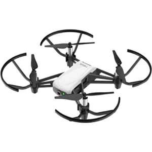

 # GesturePilot — Real-Time Hand-Gesture Drone Control with ORB-SLAM3 Safety Mapping

**RBD Lab, University of Haifa — Course: Project in Real-Time Systems (203.4724)**  
**Authors:** Zahi Haddad, Rany Mattar • **Supervisor:** Prof. Dan Feldman

This repository contains:
- `orb_slam3_mods/mono_video.cpp` — our modifications to ORB-SLAM3’s `mono_video` example (Windows fork).
- `src/Code Final.py` — Python controller for gesture-driven DJI Tello flight (MediaPipe).
- `PDF` — full project report (Hebrew).

---

## Demo (YouTube)

[](https://youtu.be/_WxSzOF9Lsw)


---

## Picture of the drone 




---

## Overview

**GesturePilot** is a real-time system that lets you fly a **DJI Tello** using **hand gestures** captured by a PC webcam (MediaPipe).
In parallel, the Tello’s UDP video stream is bridged through **OBS + VirtualCam** so a Windows fork of **ORB-SLAM3** can treat it as a camera input and produce a basic map/pose stream. We use SLAM output for **safety awareness** (e.g., verifying a 360° rotation in 30° steps), while flight control commands are sent directly via the Tello SDK.


---

## Features

* Hand-gesture vocabulary mapped to Tello SDK commands (takeoff, land, forward/back, yaw, altitude).
* Windows-friendly **ORB-SLAM3** workflow (`mono_video` example) via a community fork.
* **360° rotation verification** using SLAM yaw accumulation in **12×30°** steps.
* **Stream bridging** with **OBS + VirtualCam** to handle Tello’s single-viewer stream constraint.
* **Debouncing + cooldowns** to reduce misfires and command storms.

---

## Architecture

**Gesture pipeline**
Webcam → MediaPipe Hands → gesture classifier → debounce/cooldown → mapped command → **Tello UDP command**

**SLAM pipeline**
Tello UDP video (`udp://0.0.0.0:11111`) → **OBS** → **VirtualCam** → **ORB-SLAM3 (mono_video)** → keyframe trajectory logs → Python tails logs for yaw/coverage

> SLAM is used for **awareness**, not as hard collision avoidance.

---

## Gesture Vocabulary

| Gesture                       | Action       | Notes                               |
| ----------------------------- | ------------ | ----------------------------------- |
| Palm (all fingers up)         | `takeoff`    | Entry to flight                     |
| Call Me (thumb+pinky up)      | `land`       | Safe landing                        |
| Thumbs Up                     | `forward 20` | Distances in cm                     |
| Thumbs Down                   | `back 20`    | Reliable; paired with forward       |
| Peace (index+middle)          | `cw 30`      | Yaw right in 30° steps              |
| Okay (thumb–index loop)       | `ccw 30`     | Yaw left in 30° steps               |
| Fist                          | `down 20`    | Altitude down                       |
| Spiderman (thumb+index+pinky) | `cw 360`     | 12×30° with SLAM-based verification |

---

## Requirements

**OS & Tools (used in the project)**

* Windows 11
* Visual Studio 2022 (for the ORB-SLAM3 Windows fork)
* OBS Studio + VirtualCam
* Python 3.9+

**Python packages**

```bash
pip install opencv-python mediapipe numpy scipy
# Optional if mirroring via Python:
pip install pyvirtualcam
```

**Hardware**

* DJI Tello (Wi-Fi), PC webcam, stable indoor lighting

---

## Build & Run

### 1) ORB-SLAM3 (Windows fork) — `mono_video`

Build the Windows fork in **Release** (solution provided by the fork). Typical invocations:

```powershell
# Example: webcam index 0 with a sample monocular calibration file
.\x64\Release\slam.exe mono_video ^
  C:\Path\To\Vocabulary\ORBvoc.txt ^
  C:\Path\To\Examples\Monocular\TUM1.yaml ^
  0
```

<!-- CHANGE: Replace the three paths above with your actual local paths (ORBvoc.txt, calibration .yaml, and camera index). -->

```powershell
# Example: run on a video file instead of a live camera
.\x64\Release\slam.exe mono_video ^
  C:\Path\To\Vocabulary\ORBvoc.txt ^
  C:\Path\To\Examples\Monocular\TUM1.yaml ^
  "C:\Path\To\video.mp4"
```

<!-- CHANGE: Replace the paths above with your actual local paths. -->

### 2) OBS setup (bridge Tello UDP → VirtualCam)

1. In **OBS**, add a **Media Source** with `udp://0.0.0.0:11111`.
2. Start **Virtual Camera** in OBS.
3. Launch `mono_video` and pass the VirtualCam index (often 0/1/2).

> This avoids the Tello single-viewer limitation and keeps SLAM stable.

### 3) Python controller

```bash
# Connect to Tello Wi-Fi first (TELLO-xxxx). Ensure Windows Firewall allows Python (UDP).
python "src/Code Final.py" --webcam-index 0
```

<!-- CHANGE: Adjust the script path and --webcam-index if your layout/index differs. -->

* Show gestures to the **PC webcam**.
* The script sends Tello SDK commands and can tail SLAM logs to verify yaw coverage for the 360° routine.

---

## Robustness & Safety Notes

* **Debounce + ~2.5 s cooldown** blocks rapid repeats and flicker-induced misfires.
* **Yaw steps** standardized at **30°**; 360° is **12** steps with short pauses.
* **Motor/SDK faults**: movement is suppressed while faults are active; landing remains available.
* **Lighting/background** strongly affect hand detection—use even light and uncluttered backgrounds.
* **No obstacle sensors** on Tello—keep a safe perimeter and moderate speeds indoors.

---

## Repository Layout

```
.
├─ README.md
├─ PDF.pdf
├─ src/
│  └─ Code Final.py
├─ orb_slam3_mods/
│  └─ mono_video.cpp
└─ media/
   └─ cover.jpg   # optional image for the README
```

<!-- CHANGE: Add or remove the media/ folder and image file as you prefer; update the README image path accordingly. -->

---

## Licensing

* This project follows the GPLv4 LICENSE.

---

## References

* ORB-SLAM3: C. Campos et al., *ORB-SLAM3: An Accurate Open-Source Library for Visual, Visual-Inertial and Multi-Map SLAM* (2020).
* Windows fork(s) of ORB-SLAM3 including `mono_video` example.
* MediaPipe Hands (Google).
* OBS Project + VirtualCam.
* DJI Tello SDK documentation.

<!-- CHANGE: You may add exact repository/URL citations here (fork used, SDK docs, etc.). -->

---

## Acknowledgments

Thanks to Prof. Dan Feldman and the RBD Lab. We also acknowledge the maintainers of ORB-SLAM3 and the Windows forks we used.

```
```